
# MIT App Inventor Project

## AI2 Project Idea:
### This was the suggested app idea I chose the create.

"For the AI2 project I’d like to build an app that allows the user to sort and throw the items in the correct bins, The app would allow the user to decide between recycling, trash, or compost, and throw or (shoot) the items into the correct bins. The app would help with social impact by educating the user on which bins the items can go into and help to build environmentally friendly habits.  Some features of my app include, A bell noise, a score board, a vibration effect, different animations related to the theme and movement of the items by touch. The audience for my app is children, the idea is to help the children build knowledge and fundamental skills that can positively impact the environment and their communities".

<!--Notes to follow for this readme: This documentation should serve as a comprehensive guide to your project, covering aspects such as the platforms utilized, the features developed, the motivation behind the application, and the development process. Essentially, this documentation should reflect your application's journey and the insights gained throughout the project. If you're unsure how to structure or write the documentation, refer to the following example from the previous term for guidance on preparing effective project documentation:-->

## Platforms used to complete this project:
- I used **MIT App Inventor**, app get the gold which I had just finished completing and handing in. I used the codes to begin structuring my code, with a plan of altering the code, and deleting or adding features to it until it was a completely new code, and new app. 
- I used a **Youtube MIT App Inventor video**, to help me to understand how the functions work, and try to solve an issue I was having with one of my functions related to colliding of the imageSprites. 

## Features of the app: 
- Six imageSprites (Three are litter: "Bottle", "Trash", "Banana peel". Three are Bins: "Recycle bin", "Garbage bin", "Organic bin")
- There is a "Canvas", which is the main game area, where the actions of the game take place.  
- The "Clean Up!", button which will reset the program, and begin fun game music in the background. 
- The "Done", button will stop all functions, and music, turn all imageSprites to not visible. 
- **Alerts** the user if the action was correct by showing the word "Correct", if the user has been successful in depositing the item in the correct bin. This is accompanied by a "Positive sound", and **Green** colour is shown as a background colour when the alert takes place. 
- **Alerts** the user if the action was not correct by showing the word "Wrong", if the user has been successful in depositing the item in the correct bin. This is accompanied by a "Negative sound", and green **Red** is shown as a background colour when the alert takes place.  
- The app has a **Score Board** 0/10 which updates as the user gets the items into the correct bins. 
- When the score has reached its top limit **10/10**, it will reset to **0/10**, and a surprise image will be shown, accompanied by a fun sound effect, that is complimenting the user. 
  

## Motivations 
- My first and largest motivation, is my children, I tried to think of a way to make this project into something that would inspire my children. A game that I can make fun and interactive, that would show them what you can create if you put your mind to it. 
- I was motivated to do a project of this design due to the program that I have just finished debugging, and handing in called **"Get The Gold"**. 
- I enjoy creating interactive designs in websites, and I have a growing passion, in creating fun and interactive designs, games. 
- I felt If this project was fun, I would excel at it, and impress my teacher.
- I wanted to have fun creating this project. (I had fun)

## App creating journey:

- This application began as a slightly different version of the **"Get The Gold"** app. My programming skills are not as strong as I would like, so I decided to approach this project this way. 

### Example of **"Get The Gold"** app:
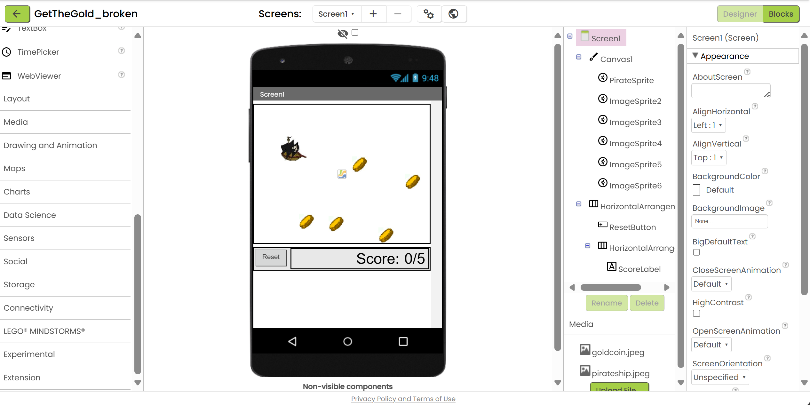
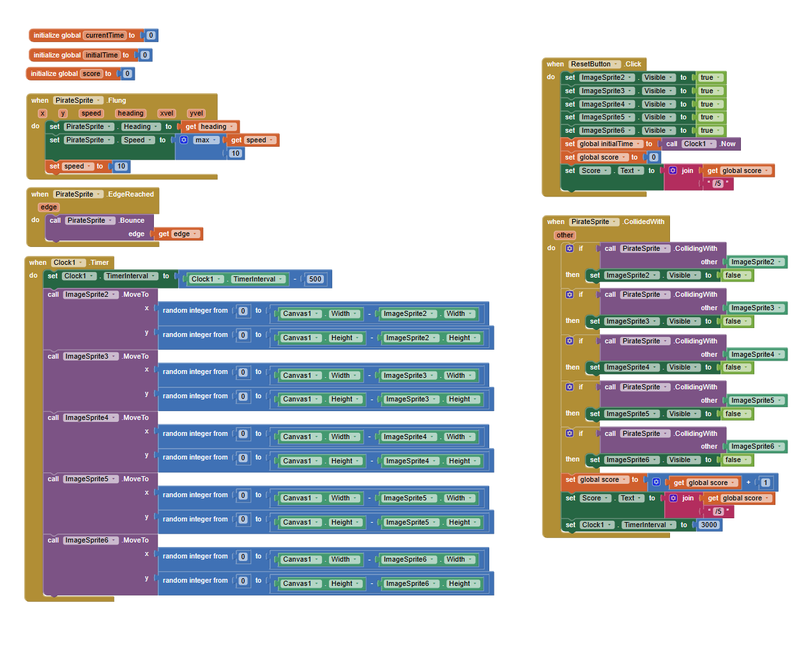

### This is my attempt one of the code: 
- At this point in the project I was having issues, the sprites all were moving as should, the music plays and stops, and the litter sprites appear/disappear. The "garbage" sprite does not bounce, it hits the wall, and stays, but it does fling, it does not react when it hits the garbage bin, or any... I felt like I had too many duplicate functions.

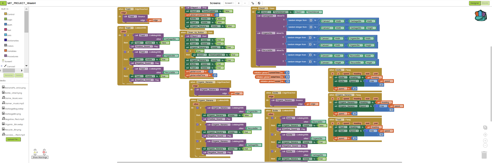
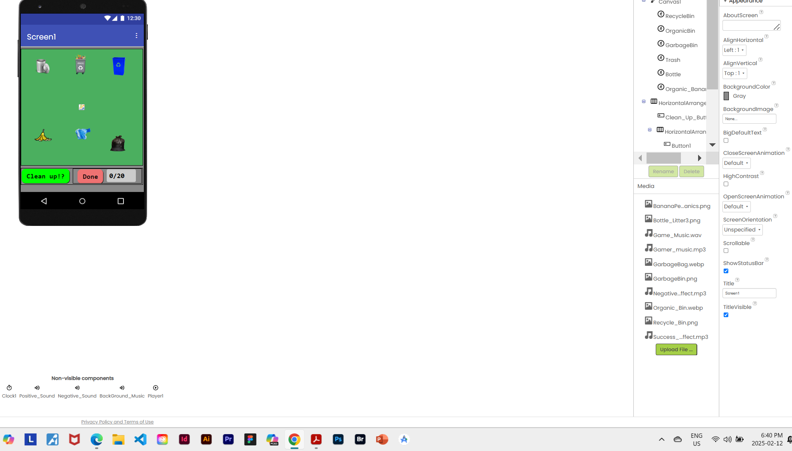

### Problem Code Function
- Here I had spent a lot of my time on to figure out what was causing the issue, and troubleshoot the code. 
- The code was appearing to be in good order to me, but the collisions between the "garbageBin" and the "trash" image sprites did not seem to work properly. 
- The collisions between the "recycleBin" and the "bottle" image sprites did not seem to work properly either.
- The code issue was very hard to figure out as I had checked over the code many times, some of the debugging I tried was "deactivating" specific portions of code, to attempt to isolate the issue in areas I suspected the code may have defects. Areas I suspected the issue may be would be in the "collision", functions. After many attempts to fix the issue I decided that this issue may be possibly caused by the the duplication of code. 
- One of the things I wanted this program (game) to do in an attempt to solve the issue was create a list of items and run through each item one at a time. I felt that too many items moving at one time, was possibly causing the problem. 
- I knew that I would be adding more items to the list in order to make the game more complex, so a list would make sense. 
- Another issue with my code is possibly I am attempting to do to many things at the same time in the same function. I would later decide to try to create modular functions that may create a more optimal design to my code, and make this issue more easily found. 

## Images of the problem codes

**Note:** The issues with this code is that the "Trash", is entering into the "recycleBin", this did solve the issue of the "Trash" not entering into the correct bin, but it was obvious this is not correct, and the issue is located some other place within the code.   
### Image of problem code single function
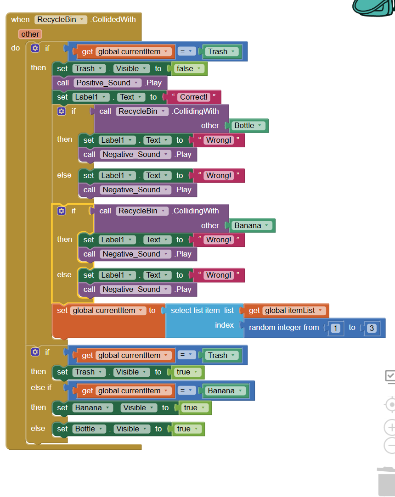

### Image of the duplication of redundant code
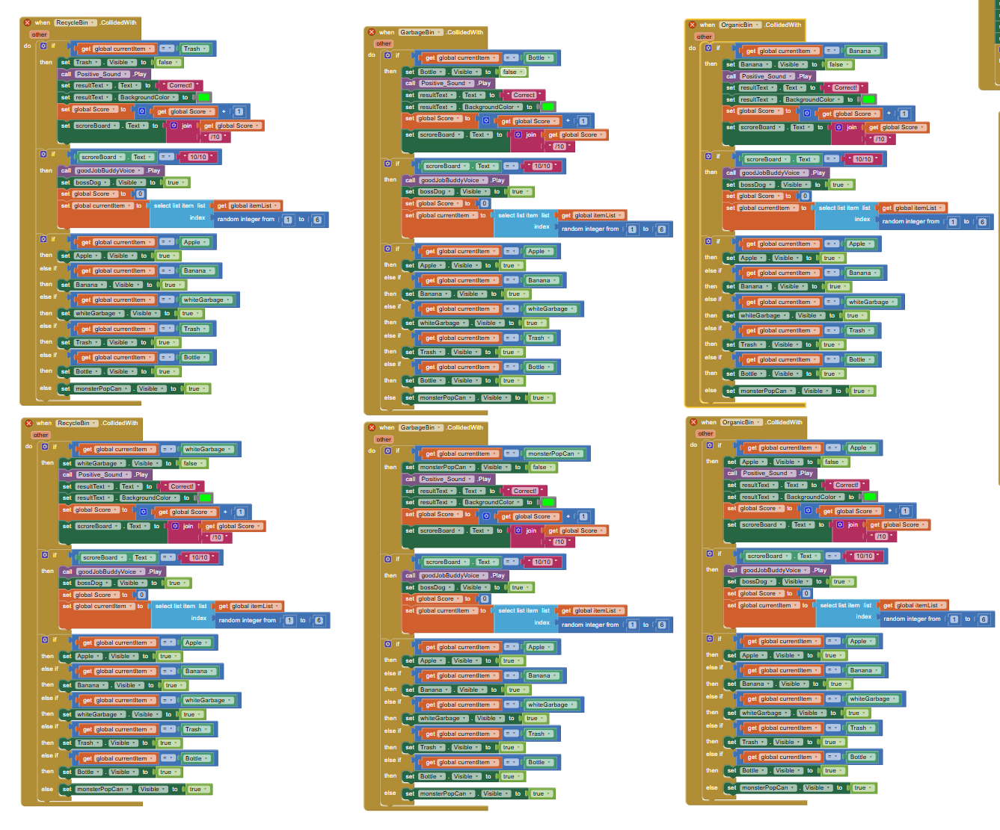

### Adding more imageSprites & code: 
- I made attempts to create modular code, to add more imageSprites to the code, and at one point this became so complex once I ran into an issue with the code that I needed to back track, and reduce my code to a more simple version of the program, so I could begin again. 
- I created specific functions for the negative noises, and the negative reactions of the game when the imageSprites go into the wrong bins. 
- I created a list of items that could be randomly extracted, one at a time, and ran thought the code, if one was successfully placed into the correct bin, the next random item would be chosen and placed into the game visibly. 
- Still the code has problems with this function of which I will mention later in this readme.md file.
- After much consideration, I decided to stick to the program without the additional image sprites, but I will say that I would create this the same way as I did but with more items. I believe the issue may be in the way I have designed the collision functions, since I have so many items and only 3 bins, possibly my logic or approach is wrong. I may want to set the collision events to the "Litter", rather than the bins. If i set it up in this way possibly I would have less issues, except every collision function has to be specific to the individual item, and this I believe would create more redundant code. so I have stuck with this. 

### Attempt to add more imageSprites image 1
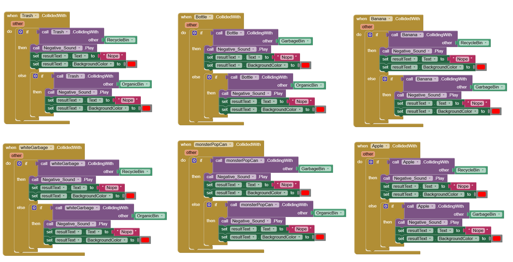

### Attempt to add more imageSprites image 2
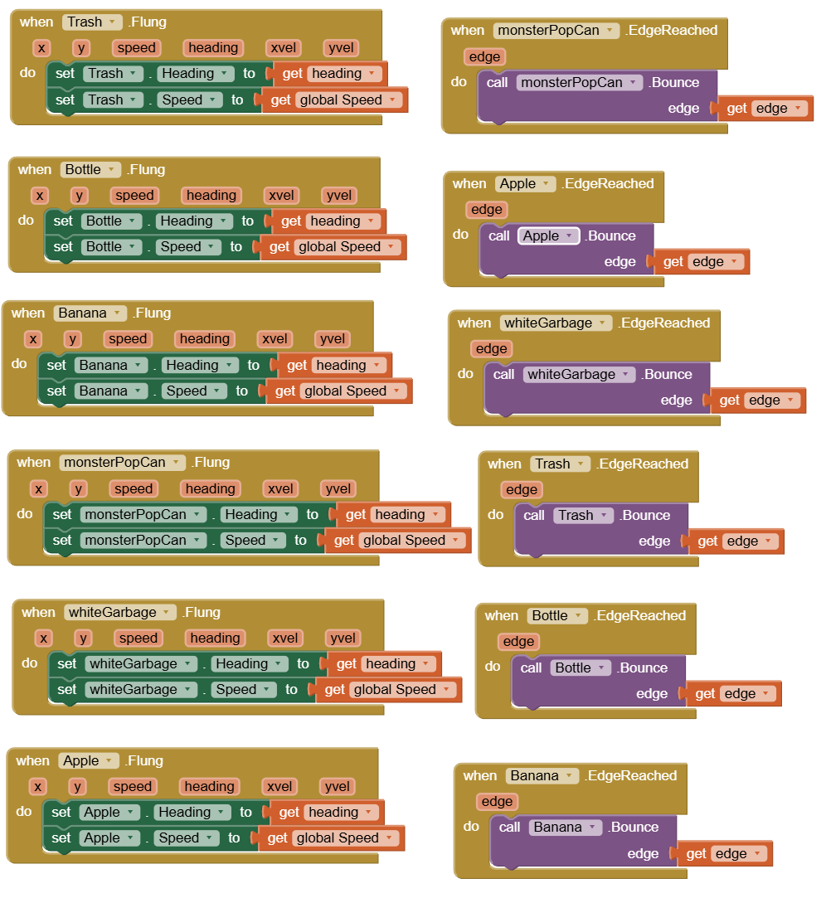

### Reduction of redundant code by creating procedures: 
  - I did not like that my collision functions had so much code, and it was creating a more complex debugging process, so I decided to create and use procedures where I could. 
  - I gained a better understanding of the reason why more modular code is significant, and also the use of procedures. It is much easier to debug and look over specific smaller functions than it is to try to look over duplicate code abundant functions in multiple locations. I often found myself copying codes and pasting them, which is bad practice, and leaves chance of error if not checked thoroughly. 
  
### Image of deleted redundant code
  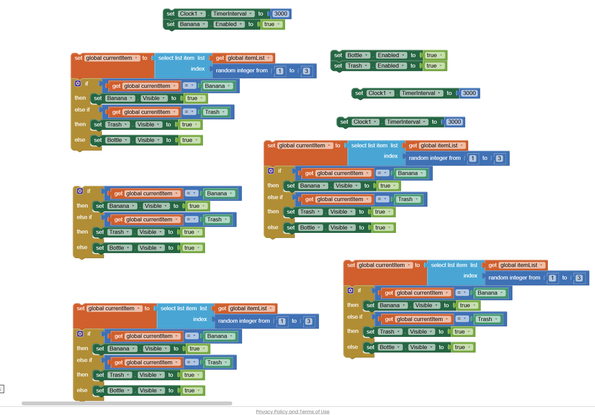

### Image of procedure created to handle redundant code
  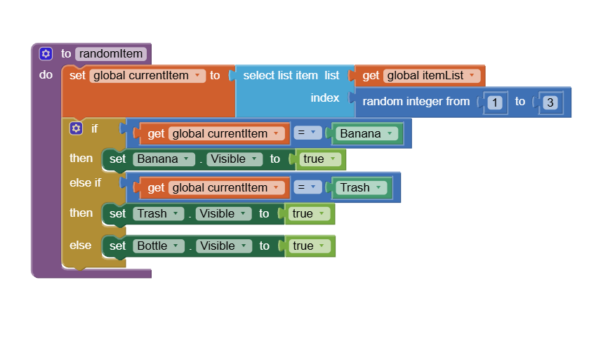

### Image of procedure to execute when game has been won
  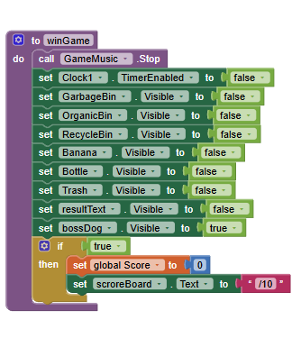

### **Note: I presented this section of my project to show my understanding of procedures, why we use them, and redundancy issues.**

## Complete code: 

### Notes: 
  - I managed to get my code to function very close to how I wanted it to but there still is some issues which I will speak about later on. 
  - The I am happy with my knowledge gained by this assignment, this really helped me to understand how things work in a program related to modular codes, and debugging, I was able to debug the program in multiple ways, as well as "commenting out blocks of code", then testing new blocks of code I would create to do the same functions. This would allow me to see if the issue was still present, if the issue was gone after, then I could convert my code to the new method. 
  - The code over all is almost completely different than the original code, with many attributes added, and a strong effort was put into this project. 
  - **The entire project took me a total of about 45 hours** I estimate, when including debugging, and trial & error.  
  - Although my program is not perfect I believe 

